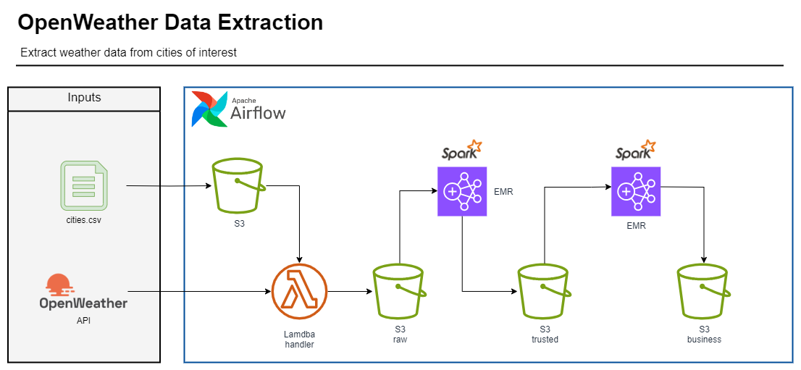
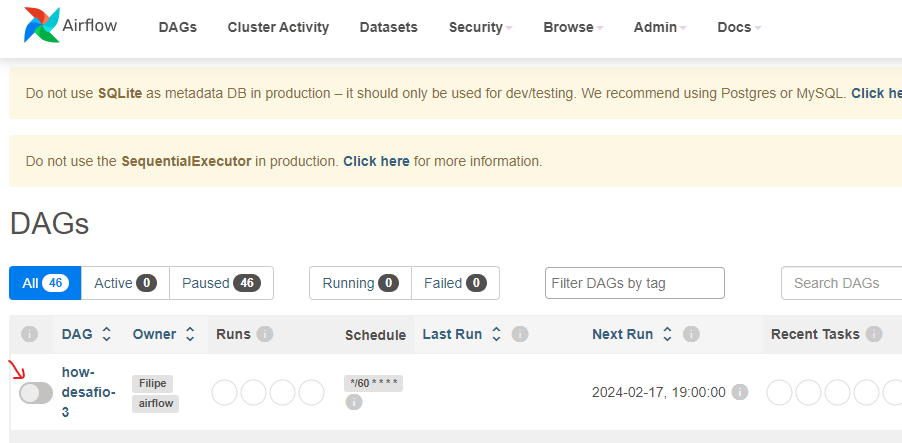
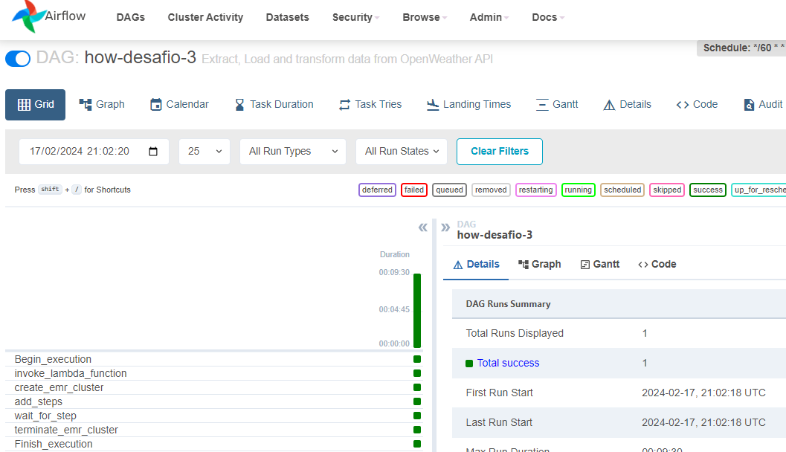
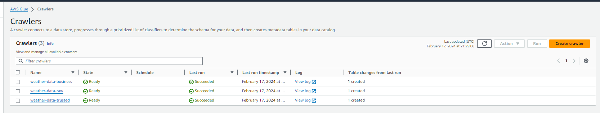
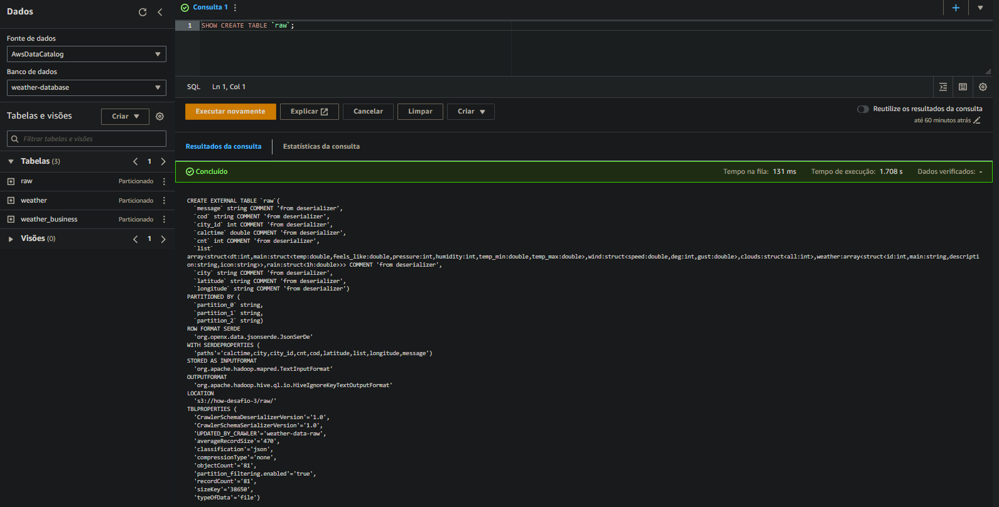
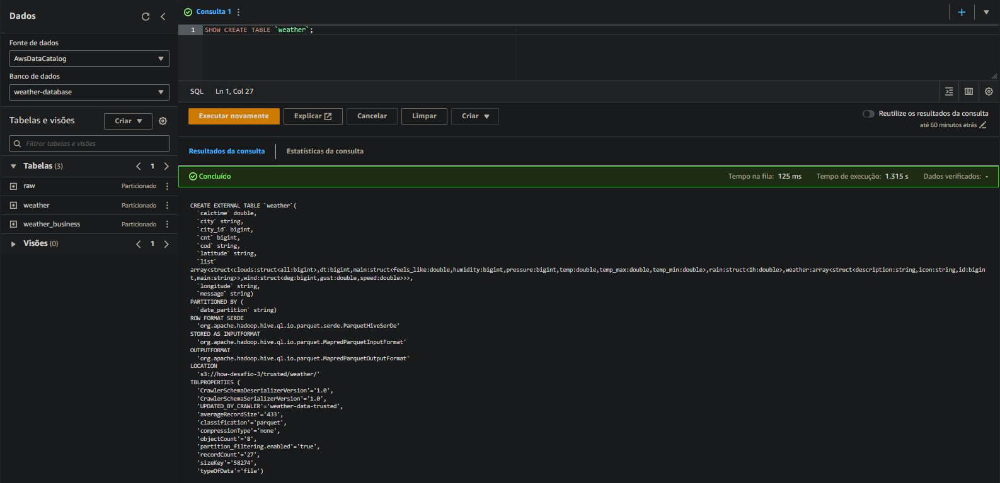
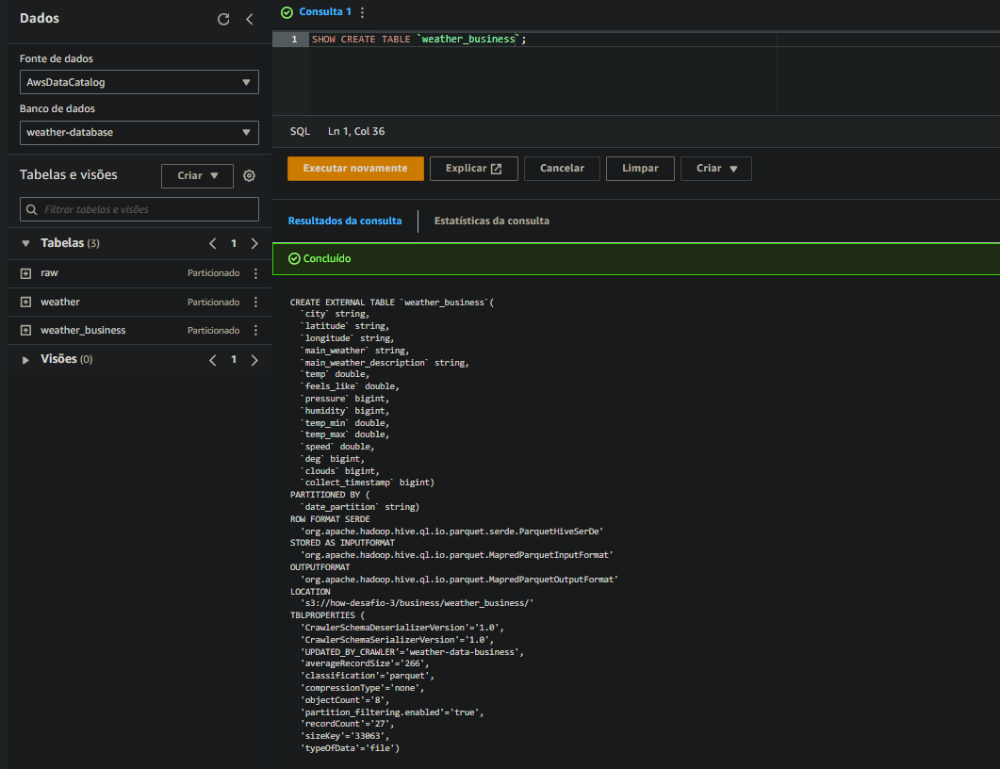

# Weather data extraction
## Extract weather data from cities of interest

This project is designed to gather weather data from the OpenWeather API through a Lambda function and store it in a raw data layer inside an S3 bucket. The data collection is centered around specified cities of interest, which are listed in a CSV file. The Lambda function is scheduled to run every hour, orchestrated by Apache Airflow. Additionally, each time the Lambda function executes, the data it is not only ingested, but also transformed, populating both the trusted and business layers with the processed information.



## Running the project:

### 1 - Clone the repository in a local folder and start airflow using the following command in the terminal:

```./airflow.sh```

### 2 - With your web browser access http://localhost:8080/home and trig the DAG:



### 3 - Wait for the DAG to finish:



### 3 - Run the following command using AWS cli to create the Cloudformation stack, where are created the databases and Glue Crawlers to catalog the tables:

```aws cloudformation create-stack --stack-name cf-create-crawler-awscli --template-body file://stack.json --capabilities CAPABILITY_NAMED_IAM```

### 4 - Run the crawlers



### 5 - See the tables at Athena:

Raw:

Trusted:

Business:
